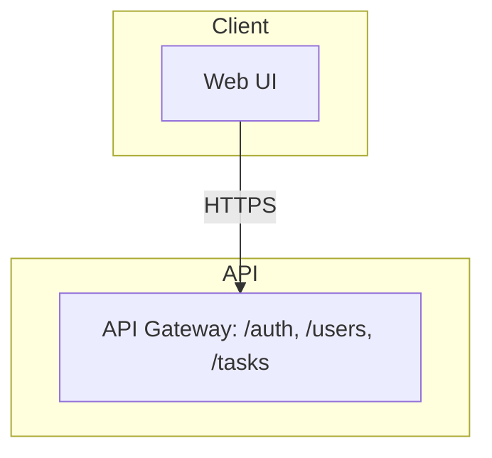
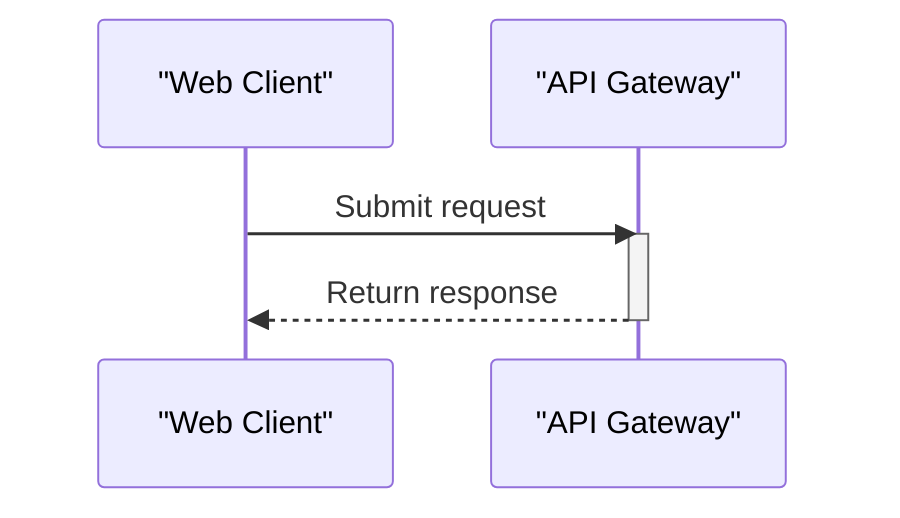

# Generate Design Documents (HLD + LLD)

You are acting as a documentation engineer. Your job is to keep this repository's
architecture documentation accurate and current by analyzing the current state of
the code and updating two documents **in the same run**:

- `docs/HLD.md` — High-Level Design
- `docs/LLD.md` — Low-Level Design

**Both documents are always produced together.** A single invocation generates or
updates BOTH files, writes both to the repo's `docs/` folder, and (if there are
changes) includes both in one pull request. Never generate one without the other.

## Execution Protocol (runner-agnostic — read this FIRST)

This skill runs in different agents (e.g. the GitHub Copilot coding agent on
github.com, or Copilot in VS Code). Do not assume any specific tool name — use
whatever file-read, file-create, file-edit, directory-list, branch, and
pull-request capabilities the current runner provides.

**Write each document as a whole, in a single file operation — one write for the
HLD, one write for the LLD.** Compose the complete document (all applicable
sections, in the order given below) and then write the entire file at once. Do NOT
split a document into many per-section writes.

**Run straight through — do not wait for the user.** Produce the complete HLD and
write it, then produce the complete LLD and write it, then continue to the change
check and PR — all in one run. Do not stop, hand back to the user, or ask them to
say "next"/"continue"/"yes" between the two documents or at any other point. If
the runner shows a file-write approval prompt, that is the runner's own behavior
(outside your control); as soon as it is approved, continue to the next step
without waiting to be told. If your runner can stage both file writes in a single
confirmation, you may write both documents together.

**Resume safely.** If re-invoked after an interruption, do not restart blindly:
read current state (do `docs/HLD.md` and `docs/LLD.md` already exist and look
complete? do the branch/PR exist?) and continue from the first incomplete
artifact. Do not create a second branch or a duplicate PR if one already exists.

## Audience

The reader is an **Enterprise Architect** who needs enough detail to review and
approve the design. Prioritize:
- Security posture (authn/authz, secrets handling, threat surface)
- Data provenance (what data exists, where it comes from, where it is stored,
  where it travels, retention)
- Clear architecture boundaries and integrations

Prose should be concise, technical, and vendor-neutral. Use bullet lists and small
tables over long paragraphs. No marketing language.

## Hard Rules

1. **Never invent facts.** Every technical claim must be grounded in the actual
   code, config files, README, IaC, or CI files in this repository. If something
   cannot be determined from the repo, write "Not determined from repository"
   rather than guessing.
2. **Update, don't rewrite.** If a document already exists, carry forward the
   existing text of sections whose subject matter hasn't changed, and only rewrite
   the sections that actually changed — then write the whole file. This keeps
   diffs small. If a document does not exist yet, generate it in full.
3. **Never commit secrets.** If you encounter what looks like a real credential
   or key, redact it in the doc (e.g. `[REDACTED]`) and add a note under Security
   flagging it for manual review. Do not reproduce it.
4. **Write scope is `docs/` only.** Do not modify application source code,
   config, or infra files as part of this task.
5. **Diagrams use Mermaid.** Any diagram must be valid Mermaid embedded in a
   fenced ```mermaid block, not an external image. Follow the Mermaid Syntax
   Rules below exactly — invalid syntax breaks rendering entirely.

## Mermaid Syntax Rules (avoid rendering errors)

Mermaid is strict, and GitHub's renderer gives no partial credit — one bad
character anywhere breaks the whole diagram.

### The one rule that prevents most failures

**Always wrap every node label and every edge label in double quotes — no
exceptions, even a single plain word.** Quoting a label that wouldn't strictly
need it is always safe; NOT quoting one that contains punctuation breaks the
whole diagram. Do not try to judge whether a label "needs" quotes — quote them
all.

- Node label: `A["API Layer"]`, never `A[API Layer]` or `A[API: /auth, /users]`.
- Edge label: `A -->|"HTTPS"| B`, never `A -->|HTTPS| B`.

This single habit eliminates the most common parse error — punctuation (commas,
slashes, parentheses, colons, ampersands, angle brackets) in an unquoted label.
Example:
- BROKEN: `Auth -->|DB queries (Devices/ApiKeys/Users)| DB`
- SAFE:   `Auth -->|"DB queries (Devices/ApiKeys/Users)"| DB`

### Remaining rules (still apply even with everything quoted)

1. **No literal double quote inside a double-quoted label** — Mermaid has no
   escape for it. Rephrase instead.
2. **No raw line break inside a label** — use `<br/>`.
3. **Don't redeclare a node's shape twice.** After `A["Text"]`, later references
   use just `A`.
4. **Node IDs contain no spaces or punctuation.** `MyNode["Text"]`, not
   `My Node["Text"]`.
5. **Use real arrow syntax** in flowcharts: `-->`, `---`, `-.->`, `==>`. A
   single-character `->` is invalid in flowchart syntax.
6. **Never use a reserved word as an ID or subgraph ID** (`end`, `graph`,
   `flowchart`, `subgraph`, `class`, `style`, `click`, `direction`). `end` is the
   most common collision — use `EndUser`/`Endpoint`.
7. **One statement per line.**
8. **Comments on their own line**, starting with `%%`.
9. **Declare direction once** (`flowchart TB`/`TD`/`LR`/`BT`/`RL`).
10. **classDef/class names are simple identifiers** (letters, digits,
    underscores).

### Sequence diagrams (LLD workflows)

11. **Quote participant display names and alias multi-word names**:
    `participant WC as "Web Client"`, then use `WC` in messages.
12. **No reserved word as a participant alias** (`end`, `loop`, `alt`, `opt`,
    `par`, `rect`, `note`, `activate`, `deactivate`).
13. **No second unescaped colon in message text** — rephrase or use `#58;`.
14. **Valid arrow types only**: `->>`, `-->>`, `-)`, `--)`, `-x`, `--x`, or
    `->`/`-->`.
15. **Every `activate` has a matching `deactivate`**, in order.

### Final check

Before finalizing any diagram, re-read it once: every node and edge label
double-quoted; no reserved words as IDs; valid arrows; every alias declared
before use; every activation closed.

Safe flowchart opening:



Safe sequence-diagram opening:



## HLD Structure (`docs/HLD.md`)

Compose the complete document with these sections, in this order. Add sections the
repo clearly warrants and omit those that don't apply; note any additions/removals
at the top of the Change Log.

1. Title & Metadata (repo name, last updated date, doc owner)
2. Executive Overview
3. Objective
4. Architecture Description (embedded Mermaid `flowchart TB`, layered subgraphs
   where they apply: Client / API / Orchestration / Core / Data, plus external
   systems on the side; label edges with protocol)
5. Core Workflows
6. Data Flow
7. Key Features
8. Infrastructure & Deployment Overview
9. Deployment Strategy
10. Data Protection (in transit, at rest, secrets, any LLM/third-party data
    sharing, logging, retention)
11. Security Requirements (authn/authz model, threat considerations, dependency
    posture)
12. Integrations (each external connection: what, why, and how it authenticates)
13. Environment Variables & Secrets Inventory (names and purposes only, never
    values)
14. Change Log (append a dated entry each update)

## LLD Structure (`docs/LLD.md`)

Compose the complete document with these sections, in this order.

1. Title & Metadata
2. Module/Component Breakdown (one subsection per major module: responsibility
   and public interface)
3. Key Classes / Functions (only architecturally significant ones: purpose,
   inputs/outputs, important side effects)
4. Data Models / Schemas (field names and types where determinable)
5. Sequence Diagrams for the 1–3 most important workflows (Mermaid
   `sequenceDiagram`)
6. Error Handling & Retry Behavior
7. Configuration & Environment-Specific Behavior
8. Known Limitations / Technical Debt (only if evident — do not speculate)
9. Change Log

## Process

Run these steps straight through, without pausing for user input between them.

1. Read `docs/HLD.md` and `docs/LLD.md` if they exist (including Change Logs) to
   learn what was last documented.
2. Inventory the repository ONCE: file tree, README, dependency manifests,
   Dockerfiles, CI configs, IaC, and `.env.example`/similar. One pass — note
   anything undetermined as "Not determined from repository" and move on.
3. Identify what is new, changed, or removed relative to the current docs.
4. **Compose the complete `docs/HLD.md`** (all applicable sections in order,
   including a dated Change Log entry) and write the whole file in one operation.
5. **Compose the complete `docs/LLD.md`** the same way and write the whole file in
   one operation.
6. If neither file differs from what's committed (check via the runner's diff/
   status capability), STOP — do not create a branch or PR.
7. If either changed, open ONE pull request containing both:
   - Branch `docs/auto-hld-<YYYYMMDD-HHMM>` off the default branch.
   - Commit both files: `docs: automated HLD/LLD update <date>`.
   - Open a PR against the default branch, titled
     `docs(hld): automated update <date>`, labeled `automerge`, body summarizing
     what changed in each document.
   - Never push directly to the default branch.

If re-invoked after an interruption, read current state and resume from the first
incomplete step — do not redo a completed file, and do not create a second branch
or a duplicate PR.
