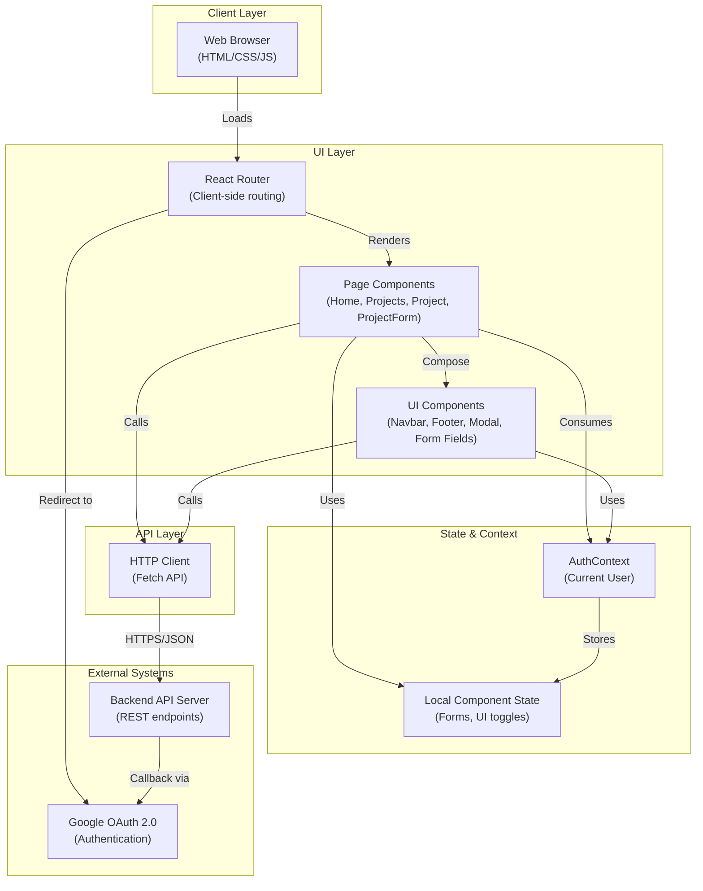

# High-Level Design (HLD)
**hackbca-example-frontend**

**Last Updated:** 2026-09-14  
**Doc Owner:** Architecture Team  
**Repository:** https://github.com/AryanBhanushali/hackbca-example-frontend

---

## Executive Overview

**hackbca-example-frontend** is a React-based web application that serves as the primary user-facing interface for hackBCA, an educational hackathon event. The application enables event participants to authenticate, browse project proposals, create new projects, collaborate with other participants, and manage project metadata.

The frontend is a single-page application (SPA) that communicates exclusively with a backend API server (via configurable `REACT_APP_API_URL`). All authentication is delegated to the backend via Google OAuth 2.0 flow. The UI is styled using Tailwind CSS with a custom brand theme, and navigation is handled by React Router v6.

**Key characteristics:**
- **Scope:** Frontend only; all business logic and data persistence handled by backend
- **Technology:** React 17, Node.js ecosystem (npm)
- **Authentication:** Google OAuth (backend-delegated)
- **Deployment:** Static build artifact suitable for CDN or static hosting
- **User Base:** hackBCA event participants (students and organizers)

## Objective

This frontend application exists to:

1. **Reduce barriers to participation** — Provide an intuitive, branded interface for hackBCA attendees to discover and propose projects
2. **Enable collaboration** — Allow multiple participants to co-own and co-develop project proposals
3. **Centralize visibility** — Aggregate project information in one place, accessible to all attendees
4. **Facilitate authentication** — Leverage Google OAuth for frictionless sign-in without managing credentials
5. **Support event management** — Enable organizers (authenticated users) to view, edit, and manage projects

**Out of scope:**
- Backend API logic, database design, or server infrastructure
- User management or role definitions (delegated to backend)
- Scheduling or calendar functionality beyond date/time selection in forms
- Real-time collaboration or live updates (polling or WebSocket not implemented)

## Architecture Description

### High-Level Layering

### Component & Module Breakdown

| **Layer** | **Module** | **Responsibility** |
|-----------|-----------|-------------------|
| **Routing** | `App.js` | Defines routes, manages auth context, orchestrates layout |
| **Pages** | `Home.js` | Landing page with event info and sign-in prompt |
| | `Projects.js` | Lists all projects in a data grid; filtering & deletion UI |
| | `Project.js` | Displays individual project details |
| | `ProjectForm.js` | Create/edit project forms with validation & submission |
| **Layout** | `Navbar.js` | Top navigation, branding, user login/logout controls |
| | `Footer.js` | Footer with sponsor links and contact info |
| **UI Primitives** | `modals.js` | Styled modal component wrapper (react-overlays) |
| | `formatting.js` | Date/time formatting utilities |
| | `types.js` | Project type definitions (Software/Hardware) |
| | `utils.js` | Helper: `getAPIURL()` for configurable backend endpoint |
| **Styling** | `index.css` | Global styles; custom properties for Tailwind |
| | `tailwind.config.js` | Brand colors (hackbca-dark-blue, hackbca-orange, etc.) |
| | `craco.config.js` | Craco config for Tailwind CSS via PostCSS |

### Data Flow Direction

**Request Flow:**
1. User interacts with page (click, form submission)
2. Component updates local state or calls API via `fetch()`
3. HTTP request sent to backend via `${getAPIURL()}/endpoint`
4. Response received; component state updated; UI re-renders

**Authentication Flow:**
1. App component mounts; calls `GET /me` to check login status (credentials: include)
2. Backend validates session cookie; returns `User` object or 401/null
3. User object stored in `AuthContext`; all pages/components can access via `useContext(AuthContext)`
4. Login link redirects to `${getAPIURL()}/login/google?redirect=<path>`; backend handles OAuth handshake
5. Logout link redirects to `${getAPIURL()}/logout`; backend clears session
