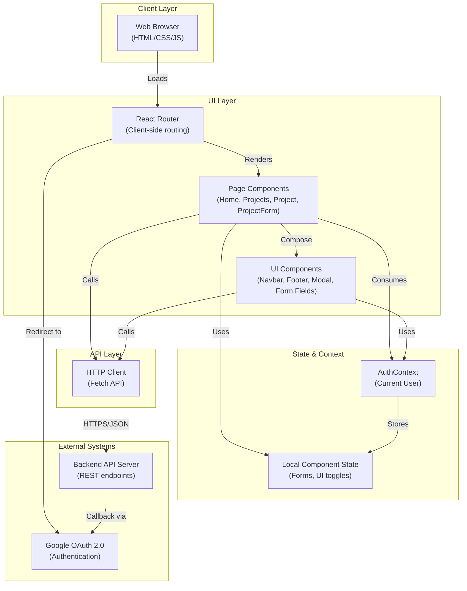

# High-Level Design (HLD)
**hackbca-example-frontend**

**Last Updated:** 2026-09-14  
**Doc Owner:** Architecture Team  
**Repository:** https://github.com/AryanBhanushali/hackbca-example-frontend

---

## Executive Overview

**hackbca-example-frontend** is a React-based web application that serves as the primary user-facing interface for hackBCA, an educational hackathon event. The application enables event participants to authenticate, browse project proposals, create new projects, collaborate with other participants, and manage project metadata.

The frontend is a single-page application (SPA) that communicates exclusively with a backend API server (via configurable `REACT_APP_API_URL`). All authentication is delegated to the backend via Google OAuth 2.0 flow. The UI is styled using Tailwind CSS with a custom brand theme, and navigation is handled by React Router v6.

**Key characteristics:**
- **Scope:** Frontend only; all business logic and data persistence handled by backend
- **Technology:** React 17, Node.js ecosystem (npm)
- **Authentication:** Google OAuth (backend-delegated)
- **Deployment:** Static build artifact suitable for CDN or static hosting
- **User Base:** hackBCA event participants (students and organizers)

## Objective

This frontend application exists to:

1. **Reduce barriers to participation** — Provide an intuitive, branded interface for hackBCA attendees to discover and propose projects
2. **Enable collaboration** — Allow multiple participants to co-own and co-develop project proposals
3. **Centralize visibility** — Aggregate project information in one place, accessible to all attendees
4. **Facilitate authentication** — Leverage Google OAuth for frictionless sign-in without managing credentials
5. **Support event management** — Enable organizers (authenticated users) to view, edit, and manage projects

**Out of scope:**
- Backend API logic, database design, or server infrastructure
- User management or role definitions (delegated to backend)
- Scheduling or calendar functionality beyond date/time selection in forms
- Real-time collaboration or live updates (polling or WebSocket not implemented)

## Architecture Description

### High-Level Layering

### Component & Module Breakdown

| **Layer** | **Module** | **Responsibility** |
|-----------|-----------|-------------------|
| **Routing** | `App.js` | Defines routes, manages auth context, orchestrates layout |
| **Pages** | `Home.js` | Landing page with event info and sign-in prompt |
| | `Projects.js` | Lists all projects in a data grid; filtering & deletion UI |
| | `Project.js` | Displays individual project details |
| | `ProjectForm.js` | Create/edit project forms with validation & submission |
| **Layout** | `Navbar.js` | Top navigation, branding, user login/logout controls |
| | `Footer.js` | Footer with sponsor links and contact info |
| **UI Primitives** | `modals.js` | Styled modal component wrapper (react-overlays) |
| | `formatting.js` | Date/time formatting utilities |
| | `types.js` | Project type definitions (Software/Hardware) |
| | `utils.js` | Helper: `getAPIURL()` for configurable backend endpoint |
| **Styling** | `index.css` | Global styles; custom properties for Tailwind |
| | `tailwind.config.js` | Brand colors (hackbca-dark-blue, hackbca-orange, etc.) |
| | `craco.config.js` | Craco config for Tailwind CSS via PostCSS |

### Data Flow Direction

**Request Flow:**
1. User interacts with page (click, form submission)
2. Component updates local state or calls API via `fetch()`
3. HTTP request sent to backend via `${getAPIURL()}/endpoint`
4. Response received; component state updated; UI re-renders

**Authentication Flow:**
1. App component mounts; calls `GET /me` to check login status (credentials: include)
2. Backend validates session cookie; returns `User` object or 401/null
3. User object stored in `AuthContext`; all pages/components can access via `useContext(AuthContext)`
4. Login link redirects to `${getAPIURL()}/login/google?redirect=<path>`; backend handles OAuth handshake
5. Logout link redirects to `${getAPIURL()}/logout`; backend clears session

## Core Workflows

### 1. User Authentication & Session Check

**Trigger:** Application load  
**Participants:** Browser, App.js, Backend, AuthContext

**Steps:**
1. User opens app in browser; React mounts `App.js`
2. `useEffect` in `App.js` fires; calls `fetch("${getAPIURL()}/me", {credentials: "include"})`
3. Backend validates session cookie
   - If valid: returns JSON user object → stored in AuthContext
   - If invalid: returns 401 or empty → user remains null in AuthContext
4. All downstream components can check `useContext(AuthContext)` to conditionally render auth-dependent UI

**Security:** Session cookie marked `HttpOnly` (backend responsibility); frontend cannot access token value

---

### 2. Sign In with Google (Backend-Delegated)

**Trigger:** User clicks "Sign in with Google" button  
**Participants:** Navbar or Home.js, Google OAuth, Backend

**Steps:**
1. User clicks sign-in button; browser redirects to `${getAPIURL()}/login/google?redirect=${encodeURIComponent(path)}`
2. Backend handles OAuth flow:
   - Redirects to Google OAuth consent screen
   - User grants permission
   - Google returns auth code to backend redirect URI
   - Backend exchanges code for tokens, validates, creates session
3. Backend sets session cookie and redirects to `redirect` param (e.g., `/projects`)
4. Browser navigates to redirect URL; `App.js` useEffect re-runs, fetches `GET /me`, gets user object
5. AuthContext updates; UI re-renders with authenticated state

---

### 3. Browse Projects

**Trigger:** User navigates to `/projects` or clicks "Projects" link  
**Participants:** Projects.js, Backend API

**Steps:**
1. `Projects.js` component mounts
2. `useEffect` calls `fetch("${getAPIURL()}/projects")` (no credentials required for read)
3. Backend returns array of `Project` objects
4. Component stores in local state; renders data grid with columns: Name, Owners, Time, Type
5. If authenticated user owns a project: edit & delete icons appear in row
6. User can click project name to navigate to `/projects/:id` (Project detail page)

**Error Handling:** If fetch fails, error message displayed; if loading, spinner shown

---

### 4. Create/Edit Project (Authenticated Users Only)

**Trigger:** User clicks "Add Project" or "Edit" button  
**Participants:** ProjectForm.js (or ProjectFormContent), Formik, Backend API

**Steps:**
1. User navigates to `/projects/new` (create) or `/projects/:id/edit` (update)
2. Component checks `useContext(AuthContext)`:
   - If not authenticated: shows "Sign in to add or edit projects"
   - If authenticated: loads form
3. For edit mode: fetches `GET /projects/:id` to pre-populate form fields
4. Formik manages form state: name, date_proposed, time, type, description, users (co-owners)
5. User selects co-owners from dropdown (populated by `GET /users`)
6. On submit:
   - `prepareInput()` transforms form values to ISO dates/times
   - Sends `POST /projects` (create) or `PUT /projects/:id` (update) with JSON body
   - Credentials included for authentication
7. On success (200): redirects to project detail page; on error (5xx): error message displayed

**Validation:** Formik validates:
   - Name is required
   - No duplicate co-owners ("quantum cloning machine" error message)

---

### 5. Delete Project

**Trigger:** User clicks trash/delete icon in Projects grid (if owner)  
**Participants:** Projects.js, Modal, Backend API

**Steps:**
1. User clicks delete icon
2. Confirmation modal displays: "Delete the project 'X'?"
3. User clicks "Yes"
4. Sends `DELETE /projects/:id` with credentials
5. On success: removes project from local state array; grid updates immediately
6. On error: error message shown

---

## Key Features

| **Feature** | **Implementation** | **Status** |
|-------------|------------------|-----------|
| **Google OAuth Sign-In** | Backend OAuth flow; frontend redirects | ✓ Implemented |
| **Session Management** | HTTP-only cookie; `GET /me` check on app load | ✓ Implemented |
| **Project Browsing** | Data grid (Tailwind grid layout); sortable? | ✓ Implemented (no sort/filter in current code) |
| **Project CRUD** | RESTful API calls; Formik forms | ✓ Implemented (create, read, update, delete) |
| **Co-Ownership** | Multi-select user dropdown; forms allow adding owners | ✓ Implemented |
| **Responsive Design** | Tailwind CSS responsive classes (sm:, md:) | ✓ Implemented (desktop-focused) |
| **Branded UI** | Custom Tailwind theme; hackbca colors, logo | ✓ Implemented |
| **Error Handling** | User-facing error messages in modals/inline | ✓ Implemented (basic) |
| **Loading States** | Spinner icons during async operations | ✓ Implemented |
| **Mobile Responsive** | Flexbox/grid; responsive typography | Partial (not optimized for mobile) |

