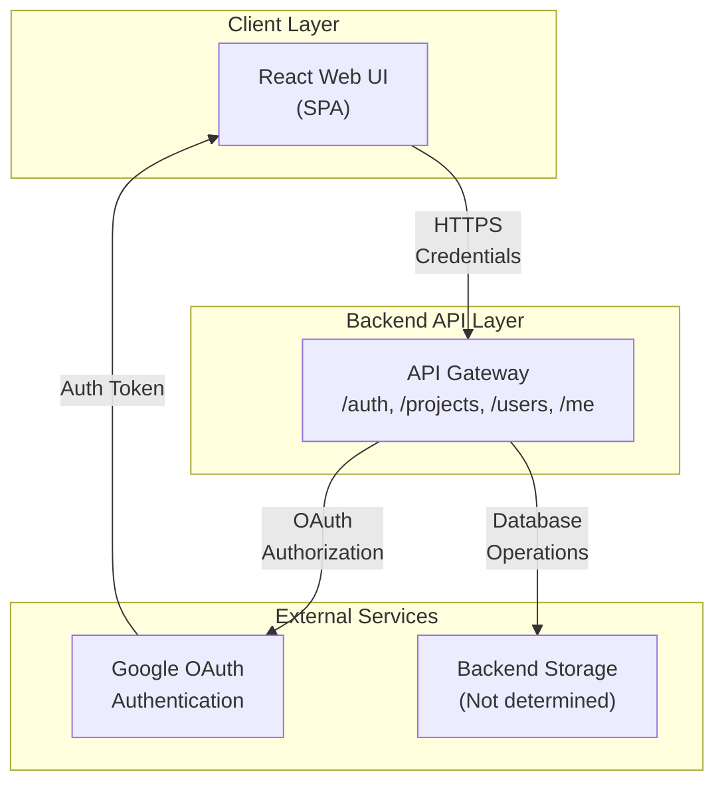

# High-Level Design (HLD)
## hackBCA Example Frontend

**Repository:** AryanBhanushali/hackbca-example-frontend  
**Last Updated:** 2026-09-14  
**Document Owner:** Architecture Team  

---

## Executive Overview

This is a React-based single-page application (SPA) for the hackBCA event platform. It provides attendees with the ability to view, create, edit, and manage project proposals for the hackBCA hackathon. The frontend communicates with a backend API for persistence and authentication.

---

## Objective

Enable hackBCA event attendees to:
- Browse available projects from other attendees
- Create new project proposals (software or hardware)
- Edit and delete their own projects
- Authenticate using Google OAuth
- View detailed project information including descriptions, team members, and links

---

## Architecture Description



**Component Layers:**
- **Client Layer:** React SPA with browser-based routing (React Router v6)
- **API Layer:** RESTful HTTP/HTTPS endpoints for projects, users, and authentication
- **External Services:** Google OAuth for authentication; backend storage (location/technology not determined from repo)

---

## Core Workflows

### 1. User Authentication
- User navigates to homepage
- Frontend fetches `/me` endpoint on mount with credentials to determine authentication status
- If unauthenticated, user is prompted to sign in with Google
- Upon login, backend redirects with auth token (mechanism: credentials-based cookies)
- User context is populated and UI updates to show authenticated state

### 2. Browse Projects
- Authenticated or unauthenticated users navigate to `/projects`
- Frontend fetches `GET /projects` to retrieve all projects
- Projects are displayed in a grid with name, owner, time, and type
- Clicking a project name navigates to detail view

### 3. View Project Details
- User navigates to `/projects/:id`
- Frontend fetches `GET /projects/:id`
- Full project details displayed: description, owners, proposed date, time, type, GitHub and external URLs
- If user is an owner, "Edit" button is available

### 4. Create Project
- Authenticated user navigates to `/projects/new`
- Formik form with validation collects: name, owners (dropdown), proposed date, time, type, description
- User selects additional owners from a dropdown list fetched from `GET /users`
- On submit, data is transformed and sent as `POST /projects` with credentials
- On success, user is redirected to the new project detail page

### 5. Update Project
- Owner navigates to `/projects/:id/edit`
- Form is pre-populated with current project data
- Changes are submitted as `PUT /projects/:id`
- On success, user is redirected to project detail page

### 6. Delete Project
- Owner clicks delete button on projects list or detail page
- Confirmation modal is displayed
- On confirmation, `DELETE /projects/:id` is called with credentials
- Project is removed from local state and list is updated

---

## Data Flow

```
Frontend (React) 
    ↔ HTTP/HTTPS (with credentials cookie)
        ↔ Backend API
            ↔ Persistent Storage (Not determined)
            ↔ Google OAuth (for authentication)
```

**Data In Transit:**
- API requests/responses use JSON over HTTPS
- Authentication credentials are sent via HTTP cookies (credentials mode: "include")
- Google OAuth redirect includes encoded redirect URL as query parameter

**Data at Rest:**
- Frontend stores user context in React state (AuthContext), not persisted locally
- Browser does not explicitly cache project data between page refreshes

---

## Key Features

| Feature | Scope |
|---------|-------|
| Google OAuth Authentication | Single Sign-On (SSO) |
| Project Listing | Browse all projects with grid layout |
| Project Details | View full project information including owners, description, links |
| Project Creation | Create new software or hardware projects with multiple owners |
| Project Editing | Update project information (owners only) |
| Project Deletion | Remove projects (owners only) |
| User Management | List users for adding as project co-owners |
| Error Handling | User-facing error messages for failed API calls |
| Loading States | Visual feedback during async operations (spinning icon) |
| Responsive UI | Tailwind CSS for responsive design; works on desktop and mobile |

---

## Infrastructure & Deployment Overview

**Technology Stack:**
- **Runtime:** Node.js (via npm)
- **Framework:** React 17.0.2 with React Router v6
- **Styling:** Tailwind CSS 2.2 (with PostCSS)
- **Build Tool:** Create React App (via Craco for Tailwind override)
- **Icons:** FontAwesome (solid, brands)
- **Form Management:** Formik 2.2 with validation
- **UI Overlays:** react-overlays (for modals)

**Build Process:**
- Source transpilation via `react-scripts` (Webpack, Babel)
- Craco configuration to inject Tailwind CSS processing
- Development: `npm start` (hot reload via CRA dev server)
- Production: `npm run build` outputs optimized bundle to `build/`
- Production serving: `serve build` (static file server)

**Environment Configuration:**
- API URL configured via `REACT_APP_API_URL` environment variable
- Defaults to `http://localhost:8000` if not set
- Must be set before build for production deployments

---

## Deployment Strategy

1. **Development:**
   - Run `npm start`
   - CRA dev server runs on port 3000
   - Connects to local backend at `http://localhost:8000`

2. **Production:**
   - Set `REACT_APP_API_URL=https://example.com` (or production API endpoint)
   - Run `npm run build`
   - Output bundle placed in `build/`
   - Serve static files via HTTP server (e.g., `serve build`, Nginx, or CDN)
   - All API requests from the browser will use the configured API URL

**Notes:**
- No server-side rendering (CSR only)
- Frontend can be deployed to static hosting (GitHub Pages, Vercel, Netlify, S3, etc.)
- CORS/credentials handling depends on backend API configuration

---

## Data Protection

### In Transit
- All communication with backend occurs over HTTPS (enforced via `REACT_APP_API_URL` configuration)
- Credentials are sent via HTTP-only cookies (set by backend)
- Google OAuth tokens are handled by the OAuth provider; frontend does not directly store them

### At Rest
- **Browser:** Frontend does not persist sensitive data locally (no localStorage, sessionStorage, or IndexedDB usage detected)
- **User Context:** Authentication state is kept in React state (AuthContext) and lost on page refresh; user must re-authenticate or rely on server-side session cookies

### Secrets
- **Environment:** `REACT_APP_API_URL` must be set at build time and is embedded in the bundle
- **No hardcoded credentials found in repository**
- Backend authentication endpoint (`/login/google`) handles credential issuance

### Third-Party Data Sharing
- **Google OAuth:** User email and basic profile are shared with Google for authentication
- **Backend API:** Project data, user emails, and authentication status are sent to backend

### Logging & Retention
- Console errors logged if fetch fails (e.g., "Got status code: {response.status}")
- No explicit logging or analytics observed in frontend code
- Retention policies depend on backend implementation (not determined)

---

## Security Requirements

### Authentication & Authorization
- **Mechanism:** Google OAuth 2.0
- **Session Management:** HTTP-only cookies (backend-managed)
- **Access Control:** Endpoints require credentials; frontend checks `AuthContext` to conditionally show/hide UI
- **Project Ownership:** Only users listed as project owners can edit or delete (enforced by backend)
- **Frontend Authorization:** Frontend does not validate authorization; only hides UI and sends request; backend must validate ownership

### Threat Considerations
1. **CSRF Protection:** Requests use credentials mode; backend must implement CSRF tokens if needed
2. **XSS Risk:** Formik/React provide HTML escaping; user-supplied text (project names, descriptions) is rendered safely
3. **Missing HTTPS Enforcement:** Frontend does not enforce HTTPS; depends on deployment configuration
4. **Session Hijacking:** Relies on HTTP-only cookies; secure flag and SameSite attributes must be set by backend
5. **API Enumeration:** Project IDs are sequential integers; API endpoints are discoverable
6. **Dependency Vulnerabilities:** package-lock.json pins versions; audit needed for React, Formik, and other libraries

### Dependency Posture
- React 17 (stable, widely maintained)
- react-router-dom v6 (stable)
- Formik v2.2 (stable, form validation)
- FontAwesome (icon library, no data handling)
- react-overlays (modal UI, stable)
- Tailwind CSS (styling, stable)
- No known critical CVEs in primary dependencies as of documentation date

---

## Integrations

| External System | Purpose | Authentication | Data Exchanged |
|---|---|---|---|
| Google OAuth | User login/SSO | OAuth 2.0 redirect flow | Email, basic profile |
| Backend API (generic) | Project/user management | HTTP-only cookies + credentials header | JSON: projects, users, auth state |

**Google OAuth Flow:**
- Frontend redirects user to `${getAPIURL()}/login/google?redirect=<encoded_path>`
- Backend handles OAuth handshake
- Redirect parameter allows post-login return to the page user was viewing

**Backend API Details:**
- Base URL: `process.env.REACT_APP_API_URL` (default: `http://localhost:8000`)
- Endpoints: `/me`, `/projects`, `/projects/:id`, `/users`, `/login/google`, `/logout`
- All requests include `credentials: "include"` to send cookies

---

## Environment Variables & Secrets Inventory

| Variable | Purpose | Default | Scope |
|----------|---------|---------|-------|
| `REACT_APP_API_URL` | Backend API endpoint URL | `http://localhost:8000` | Build-time; embedded in bundle |

**Notes:**
- No runtime `.env` loading; all environment variables must be set before build
- `REACT_APP_` prefix is required for Create React App to expose variables to the bundle
- No other secrets found in the repository

---

## Change Log

### 2026-09-14 - Initial Documentation
- Generated HLD for hackBCA Example Frontend
- Documented architecture, workflows, data flows, and security posture
- Identified key components: React SPA, Google OAuth, RESTful API
- Noted areas not determined from repository: backend storage technology, CSRF/logging implementation, exact deployment environment

