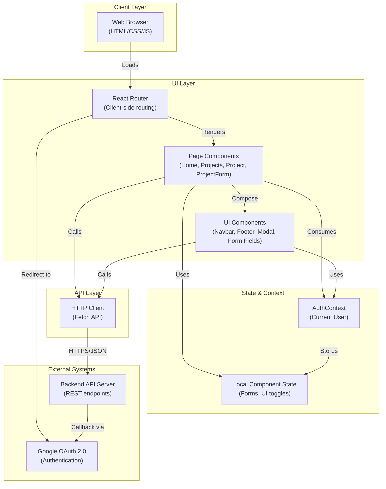

# High-Level Design (HLD)
**hackbca-example-frontend**

**Last Updated:** 2026-09-14  
**Doc Owner:** Architecture Team  
**Repository:** https://github.com/AryanBhanushali/hackbca-example-frontend

---

## Executive Overview

**hackbca-example-frontend** is a React-based web application that serves as the primary user-facing interface for hackBCA, an educational hackathon event. The application enables event participants to authenticate, browse project proposals, create new projects, collaborate with other participants, and manage project metadata.

The frontend is a single-page application (SPA) that communicates exclusively with a backend API server (via configurable `REACT_APP_API_URL`). All authentication is delegated to the backend via Google OAuth 2.0 flow. The UI is styled using Tailwind CSS with a custom brand theme, and navigation is handled by React Router v6.

**Key characteristics:**
- **Scope:** Frontend only; all business logic and data persistence handled by backend
- **Technology:** React 17, Node.js ecosystem (npm)
- **Authentication:** Google OAuth (backend-delegated)
- **Deployment:** Static build artifact suitable for CDN or static hosting
- **User Base:** hackBCA event participants (students and organizers)

## Objective

This frontend application exists to:

1. **Reduce barriers to participation** — Provide an intuitive, branded interface for hackBCA attendees to discover and propose projects
2. **Enable collaboration** — Allow multiple participants to co-own and co-develop project proposals
3. **Centralize visibility** — Aggregate project information in one place, accessible to all attendees
4. **Facilitate authentication** — Leverage Google OAuth for frictionless sign-in without managing credentials
5. **Support event management** — Enable organizers (authenticated users) to view, edit, and manage projects

**Out of scope:**
- Backend API logic, database design, or server infrastructure
- User management or role definitions (delegated to backend)
- Scheduling or calendar functionality beyond date/time selection in forms
- Real-time collaboration or live updates (polling or WebSocket not implemented)

## Architecture Description

### High-Level Layering



### Component & Module Breakdown

| **Layer** | **Module** | **Responsibility** |
|-----------|-----------|-------------------|
| **Routing** | `App.js` | Defines routes, manages auth context, orchestrates layout |
| **Pages** | `Home.js` | Landing page with event info and sign-in prompt |
| | `Projects.js` | Lists all projects in a data grid; filtering & deletion UI |
| | `Project.js` | Displays individual project details |
| | `ProjectForm.js` | Create/edit project forms with validation & submission |
| **Layout** | `Navbar.js` | Top navigation, branding, user login/logout controls |
| | `Footer.js` | Footer with sponsor links and contact info |
| **UI Primitives** | `modals.js` | Styled modal component wrapper (react-overlays) |
| | `formatting.js` | Date/time formatting utilities |
| | `types.js` | Project type definitions (Software/Hardware) |
| | `utils.js` | Helper: `getAPIURL()` for configurable backend endpoint |
| **Styling** | `index.css` | Global styles; custom properties for Tailwind |
| | `tailwind.config.js` | Brand colors (hackbca-dark-blue, hackbca-orange, etc.) |
| | `craco.config.js` | Craco config for Tailwind CSS via PostCSS |

### Data Flow Direction

**Request Flow:**
1. User interacts with page (click, form submission)
2. Component updates local state or calls API via `fetch()`
3. HTTP request sent to backend via `${getAPIURL()}/endpoint`
4. Response received; component state updated; UI re-renders

**Authentication Flow:**
1. App component mounts; calls `GET /me` to check login status (credentials: include)
2. Backend validates session cookie; returns `User` object or 401/null
3. User object stored in `AuthContext`; all pages/components can access via `useContext(AuthContext)`
4. Login link redirects to `${getAPIURL()}/login/google?redirect=<path>`; backend handles OAuth handshake
5. Logout link redirects to `${getAPIURL()}/logout`; backend clears session

## Core Workflows

### 1. User Authentication & Session Check

**Trigger:** Application load  
**Participants:** Browser, App.js, Backend, AuthContext

**Steps:**
1. User opens app in browser; React mounts `App.js`
2. `useEffect` in `App.js` fires; calls `fetch("${getAPIURL()}/me", {credentials: "include"})`
3. Backend validates session cookie
   - If valid: returns JSON user object → stored in AuthContext
   - If invalid: returns 401 or empty → user remains null in AuthContext
4. All downstream components can check `useContext(AuthContext)` to conditionally render auth-dependent UI

**Security:** Session cookie marked `HttpOnly` (backend responsibility); frontend cannot access token value

---

### 2. Sign In with Google (Backend-Delegated)

**Trigger:** User clicks "Sign in with Google" button  
**Participants:** Navbar or Home.js, Google OAuth, Backend

**Steps:**
1. User clicks sign-in button; browser redirects to `${getAPIURL()}/login/google?redirect=${encodeURIComponent(path)}`
2. Backend handles OAuth flow:
   - Redirects to Google OAuth consent screen
   - User grants permission
   - Google returns auth code to backend redirect URI
   - Backend exchanges code for tokens, validates, creates session
3. Backend sets session cookie and redirects to `redirect` param (e.g., `/projects`)
4. Browser navigates to redirect URL; `App.js` useEffect re-runs, fetches `GET /me`, gets user object
5. AuthContext updates; UI re-renders with authenticated state

---

### 3. Browse Projects

**Trigger:** User navigates to `/projects` or clicks "Projects" link  
**Participants:** Projects.js, Backend API

**Steps:**
1. `Projects.js` component mounts
2. `useEffect` calls `fetch("${getAPIURL()}/projects")` (no credentials required for read)
3. Backend returns array of `Project` objects
4. Component stores in local state; renders data grid with columns: Name, Owners, Time, Type
5. If authenticated user owns a project: edit & delete icons appear in row
6. User can click project name to navigate to `/projects/:id` (Project detail page)

**Error Handling:** If fetch fails, error message displayed; if loading, spinner shown

---

### 4. Create/Edit Project (Authenticated Users Only)

**Trigger:** User clicks "Add Project" or "Edit" button  
**Participants:** ProjectForm.js (or ProjectFormContent), Formik, Backend API

**Steps:**
1. User navigates to `/projects/new` (create) or `/projects/:id/edit` (update)
2. Component checks `useContext(AuthContext)`:
   - If not authenticated: shows "Sign in to add or edit projects"
   - If authenticated: loads form
3. For edit mode: fetches `GET /projects/:id` to pre-populate form fields
4. Formik manages form state: name, date_proposed, time, type, description, users (co-owners)
5. User selects co-owners from dropdown (populated by `GET /users`)
6. On submit:
   - `prepareInput()` transforms form values to ISO dates/times
   - Sends `POST /projects` (create) or `PUT /projects/:id` (update) with JSON body
   - Credentials included for authentication
7. On success (200): redirects to project detail page; on error (5xx): error message displayed

**Validation:** Formik validates:
   - Name is required
   - No duplicate co-owners ("quantum cloning machine" error message)

---

### 5. Delete Project

**Trigger:** User clicks trash/delete icon in Projects grid (if owner)  
**Participants:** Projects.js, Modal, Backend API

**Steps:**
1. User clicks delete icon
2. Confirmation modal displays: "Delete the project 'X'?"
3. User clicks "Yes"
4. Sends `DELETE /projects/:id` with credentials
5. On success: removes project from local state array; grid updates immediately
6. On error: error message shown

---

## Key Features

| **Feature** | **Implementation** | **Status** |
|-------------|------------------|-----------|
| **Google OAuth Sign-In** | Backend OAuth flow; frontend redirects | ✓ Implemented |
| **Session Management** | HTTP-only cookie; `GET /me` check on app load | ✓ Implemented |
| **Project Browsing** | Data grid (Tailwind grid layout); sortable? | ✓ Implemented (no sort/filter in current code) |
| **Project CRUD** | RESTful API calls; Formik forms | ✓ Implemented (create, read, update, delete) |
| **Co-Ownership** | Multi-select user dropdown; forms allow adding owners | ✓ Implemented |
| **Responsive Design** | Tailwind CSS responsive classes (sm:, md:) | ✓ Implemented (desktop-focused) |
| **Branded UI** | Custom Tailwind theme; hackbca colors, logo | ✓ Implemented |
| **Error Handling** | User-facing error messages in modals/inline | ✓ Implemented (basic) |
| **Loading States** | Spinner icons during async operations | ✓ Implemented |
| **Mobile Responsive** | Flexbox/grid; responsive typography | Partial (not optimized for mobile) |

## Data Flow

### User & Authentication Data

- **Origination:** Google OAuth backend flow; backend stores user records in database
- **Storage:** Backend database (entity: `User`)
- **Transit:** JSON over HTTPS; session cookie (HttpOnly, SameSite)
- **Lifetime:** Session persists for duration of browser session; cleared on logout or cookie expiry
- **Accessed by:** All pages via `AuthContext`; especially Navbar, ProjectForm, Projects

### Project Data

- **Origination:** User form submissions or backend creation
- **Storage:** Backend database (entity: `Project`)
- **Transit:** JSON over HTTPS in request/response bodies
- **Lifetime:** Persistent in backend; project objects immutable on frontend (no local caching)
- **CRUD Endpoints:**
  - `GET /projects` — list all projects
  - `GET /projects/:id` — fetch single project details
  - `POST /projects` — create new project (requires auth)
  - `PUT /projects/:id` — update project (requires auth, owner check)
  - `DELETE /projects/:id` — delete project (requires auth, owner check)

### User List (For Co-Ownership Selection)

- **Origination:** Backend user table
- **Storage:** Backend database
- **Transit:** JSON over HTTPS; `GET /users` endpoint
- **Lifetime:** Fetched on-demand during project form load; no caching
- **Used by:** ProjectForm.js for populating co-owner dropdown

## Infrastructure & Deployment Overview

### Build & Deployment Pipeline

**Build Step:**
```
npm install          # Resolve dependencies
npm run build        # Craco build: compiles JSX, applies Tailwind, minifies
                     # Output: ./build/ directory (static assets)
```

**Environment Configuration:**
- `REACT_APP_API_URL` — Backend API endpoint; defaults to `http://localhost:8000` if unset
- Set via `.env` file or build-time environment variable

**Deployment Artifact:**
- Static files in `build/` directory
- Suitable for any static host: CDN (Vercel, Netlify), S3 + CloudFront, Apache, Nginx, etc.
- No server-side runtime required

**Hosting Options (Not Determined from Repository):**
- Environment-specific deployment configuration not found in repo
- Assumed: CI/CD pipeline exists to deploy `build/` to production host

### Development Environment

- **Node.js Version:** Not determined from repository
- **Package Manager:** npm (see package.json and package-lock.json)
- **Dev Server:** `npm start` runs Craco dev server (port 3000, typically)
- **Test Runner:** `npm test` (Jest + react-testing-library, per package.json)

### Browser Support

From `package.json` browserslist:
- **Production:** Modern browsers only; >0.2% market share, not dead, not op_mini
- **Development:** Last version of Chrome, Firefox, Safari

### Dependencies (Security-Relevant)

| **Package** | **Purpose** | **Version** | **Notes** |
|-------------|-----------|-----------|----------|
| `react` | UI framework | ^17.0.2 | Core dependency |
| `react-dom` | DOM rendering | ^17.0.2 | Core dependency |
| `react-router-dom` | Client-side routing | ^6.0.1 | Relatively recent; v6 API used |
| `formik` | Form state management | ^2.2.9 | Handles validation, submission |
| `react-overlays` | Modal component library | ^5.1.1 | Provides Modal primitive |
| `tailwindcss` | CSS utility framework | @tailwindcss/postcss7-compat@^2.2.17 | PostCSS 7 compat variant |
| `@fortawesome/react-fontawesome` | Icon library | ^0.1.16 | Displays FontAwesome icons |

## Deployment Strategy

### Build Process

1. **Install Dependencies:** `npm install` (or `npm ci` in CI)
2. **Set Environment:** Export `REACT_APP_API_URL` (e.g., `REACT_APP_API_URL=https://api.example.com`)
3. **Build:** `npm run build` → outputs minified static files to `build/`
4. **Verify:** (Not determined from repo; CI/CD should run tests: `npm test`)
5. **Deploy:** Copy `build/` contents to static host

### Deployment Environments

**Development:**
- `REACT_APP_API_URL=http://localhost:8000`
- Served locally via `npm start`

**Staging/Production:**
- `REACT_APP_API_URL=https://api.hackbca.example.com` (or similar)
- Served via CDN or static host
- Deployed on git push to main branch (assumed; not determined from repo)

### Rollback & Versioning

- **Versioning:** Not determined from repository (no semantic version or tag strategy found)
- **Rollback:** Assumed available on deployment platform (CDN/S3 versioning, git revert, etc.)

### Monitoring & Observability (Not Determined)

- Error tracking: Not determined (Sentry, LogRocket, or similar not configured in code)
- Performance monitoring: `reportWebVitals()` exists but endpoint unknown
- Logging: Browser console only; no centralized logging

## Data Protection

### Data in Transit

- **Protocol:** HTTPS/TLS only (enforced by backend configuration; frontend uses `fetch()` without explicit protocol handling)
- **API Communication:** All backend requests via HTTPS; assumes backend enforces HTTPS redirects
- **Session Cookie:** Marked `HttpOnly` and `SameSite` by backend; frontend cannot inspect or modify

**Risk:** If backend is misconfigured or does not enforce HTTPS, credentials could be exposed. Frontend has no control over this layer.

### Data at Rest

- **No frontend storage of sensitive data:** Credentials, tokens, and PII are NOT stored in localStorage, sessionStorage, or IndexedDB
- **Session-only storage:** User object lives in React Context only; cleared on page refresh or logout
- **Form data:** Temporarily held in Formik state; cleared on form reset or navigation away
- **Browser cache:** Static assets (CSS, JS) may be cached by browser; no sensitive data in cache

### Secrets & Credentials

**Frontend Environment Variables (Build-Time):**
- `REACT_APP_API_URL` — Backend endpoint URL; **not a secret** (publicly visible in network requests)
- No Google OAuth client ID or secrets stored in frontend code
- No API keys or database credentials in frontend

**Google OAuth Secrets (Backend-Held):**
- Google OAuth client ID/secret managed exclusively by backend
- Frontend redirects to backend OAuth endpoint; backend handles token exchange
- Frontend never sees OAuth tokens

**Manual Review Flag:**
- No hardcoded credentials detected in code review
- Footer contains placeholder email `hackbca@____` (incomplete contact; low risk)

### Data Retention

- **User session:** Duration of browser session (typically hours); cleared on logout or expiry
- **Project data:** Retained in backend database indefinitely (frontend has no visibility into deletion/archival policies)
- **Browser cache/cookies:** Cleared per browser settings or session end

### Third-Party Data Sharing

- **Google OAuth:** User ID and email shared with Google as part of OAuth flow; backend stores user record locally
- **No analytics tracking:** No Google Analytics, Mixpanel, or similar detected in code
- **No LLM usage:** No AI/LLM third-party integrations found

### Logging & Audit Trail

- **Frontend logging:** Console-only; no centralized logs
- **Backend audit trail:** Not determined from frontend code; assumed backend logs API calls and auth events
- **User activity logging:** Frontend cannot audit; backend responsible for tracking CRUD operations

## Security Requirements

### Authentication & Authorization

**Authn:**
- Google OAuth 2.0 via backend; frontend initiates redirect, backend validates
- Session cookie set by backend; frontend includes via `credentials: "include"` in fetch calls
- No multi-factor authentication (MFA) visible in code; backend responsible

**Authz:**
- Read-only endpoints (e.g., `GET /projects`, `GET /users`) accessible to unauthenticated users
- Write endpoints (`POST`, `PUT`, `DELETE`) require valid session cookie; backend enforces ownership checks
- Frontend conditionally hides UI (edit/delete buttons) but relies on backend for enforcement

**Risk:** Frontend UI can be bypassed (e.g., attacker modifies browser console); backend must enforce all authorization checks.

### Threat Model & Considerations

| **Threat** | **Attack Vector** | **Mitigation** | **Residual Risk** |
|-----------|-------------------|----------------|------------------|
| **XSS (Cross-Site Scripting)** | Injected JS in project description or user input | React automatically escapes JSX; Formik/user input sanitized by form validation | Low; assumes React/React Router are not compromised |
| **CSRF (Cross-Site Request Forgery)** | Malicious site triggers API request on behalf of user | HTTPS + SameSite cookies; backend should validate CSRF tokens | Medium; frontend does not implement explicit CSRF protection (e.g., no X-CSRF-Token header) |
| **Man-in-the-Middle (MitM)** | Attacker intercepts HTTPS traffic | TLS/HTTPS enforced by backend; frontend uses `fetch()` | Low; assumes valid certificates and HTTPS enforcement |
| **Session Hijacking** | Attacker steals session cookie | HttpOnly cookies; SameSite attribute (backend-controlled) | Low for HttpOnly; higher if cookies are not SameSite |
| **Credential Exposure** | Hardcoded secrets in code/config | No secrets detected in frontend code; backend holds OAuth secrets | Low; frontend is stateless |
| **Dependency Vulnerabilities** | Unpatched npm packages with exploits | npm dependencies pinned in package-lock.json; no automated update strategy found | Medium; old versions of React (17) and react-router (v6 early) may have unpatched vulns |
| **Unauthorized Project Deletion** | User deletes another user's project | Backend enforces ownership check on DELETE | Medium; frontend relies on backend validation |

### Dependency Security Posture

- **React 17:** LTS version; consider upgrading to React 18+ for newer security patches
- **react-router-dom v6:** Early v6 release; minor updates available for bug fixes
- **Formik v2.2.9:** Stable; no known critical vulns
- **Dependencies outdated:** No `.npmrc` or lock file auto-update policy found; manual review recommended

**Recommendation:** Audit npm dependencies for known vulnerabilities via `npm audit`; implement automated dependency updates or scheduled manual reviews.

### Compliance & Data Governance

- **Data Residency:** Not determined from code (backend database location unknown)
- **GDPR/Privacy:** User consent for Google OAuth managed by backend; frontend has no explicit privacy controls
- **PII Handling:** Project descriptions, URLs, and owner emails are user-generated; frontend displays without encryption or redaction
- **Backup/Recovery:** Not visible in frontend; backend responsibility

## Integrations

### Backend API Server

**URL:** `${getAPIURL()}` (defaults to `http://localhost:8000`)  
**Protocol:** HTTP/HTTPS (depends on build-time env var)  
**Authentication:** Session cookie (HttpOnly, backend-set)

**Endpoints Used:**

| **Method** | **Endpoint** | **Purpose** | **Auth Required** | **Response** |
|-----------|-------------|-----------|------------------|------------|
| GET | `/me` | Check current user login status | Yes (cookie) | User object or 401 |
| POST | `/login/google?redirect=<path>` | Initiate Google OAuth flow | No | Redirect to Google; then back to app |
| GET | `/logout` | Clear session | Yes (cookie) | Redirect to home or logout page |
| GET | `/projects` | List all projects | No | Array of Project objects |
| GET | `/projects/:id` | Fetch single project | No | Project object or 404 |
| POST | `/projects` | Create new project | Yes (cookie) | Project object (with ID) or error |
| PUT | `/projects/:id` | Update project | Yes (cookie) + ownership | Updated Project object or 403/404 |
| DELETE | `/projects/:id` | Delete project | Yes (cookie) + ownership | 204 No Content or 403/404 |
| GET | `/users` | List all users (for co-ownership selection) | No | Array of User objects (id, email) |

**Error Handling:**
- 4xx errors: Displayed to user as "An error occurred while X"
- 5xx errors: Treated as generic server errors; details hidden from user
- Network errors (no response): Caught in catch block; error state set

---

### Google OAuth 2.0

**Provider:** Google  
**Flow:** Backend-delegated OAuth Authorization Code flow  
**Frontend Role:** Initiates redirect to `${getAPIURL()}/login/google`; receives redirect back

**Data Exchanged:**
1. User consents on Google sign-in screen (managed by backend)
2. Backend exchanges auth code for ID token + refresh token
3. Backend stores user info locally; no token returned to frontend

**Security:**
- OAuth secrets (client ID/secret) held by backend only
- Frontend never sees access tokens or refresh tokens
- PKCE or other advanced OAuth features: Not determined from frontend code (backend implementation detail)

---

## Environment Variables & Secrets Inventory

### Build-Time Environment Variables (Public)

| **Variable** | **Purpose** | **Example** | **Required** | **Notes** |
|-----------|-----------|-----------|-----------|----------|
| `REACT_APP_API_URL` | Backend API endpoint | `https://api.hackbca.example.com` | No; defaults to `http://localhost:8000` | Exposed in all network requests; not a secret |

### Derived Configuration (Frontend Logic)

| **Source** | **Derived Value** | **Usage** |
|-----------|-----------------|---------|
| `REACT_APP_API_URL` | Login redirect URL: `${getAPIURL()}/login/google?redirect=...` | Navbar, Home page |
| `REACT_APP_API_URL` | Logout redirect URL: `${getAPIURL()}/logout` | Navbar |
| `REACT_APP_API_URL` | API base URL for all fetch calls | All pages |

### Secrets (NOT in Frontend)

The following are backend-held and NOT exposed in frontend code:

- Google OAuth Client ID (backend uses to redirect to Google; frontend only sees logout/login URLs)
- Google OAuth Client Secret (backend-only)
- Database credentials
- API authentication tokens or keys (session cookie is bearer token, HttpOnly-protected)
- Third-party API keys (if any)

### No .env.example File Found

Repository does not contain `.env.example` or `.env` template. Developers must manually set `REACT_APP_API_URL` during build or via environment variable.

**Recommendation:** Add `.env.example`:
```
REACT_APP_API_URL=http://localhost:8000
```

---

## Change Log

**2026-09-14 — Initial Bootstrap**
- Created HLD from repository analysis
- Documented architecture: React Router, Pages, Components, API integrations
- Identified workflows: Auth, Browse, Create/Edit, Delete projects
- Mapped data flows: User, Project, User List
- Outlined deployment: Static build artifact, HTTPS, configurable backend URL
- Noted security: Google OAuth delegation, session cookies, no frontend secrets
- Flagged gaps: No `.env.example`, no monitoring endpoint known, dependency audit recommended
