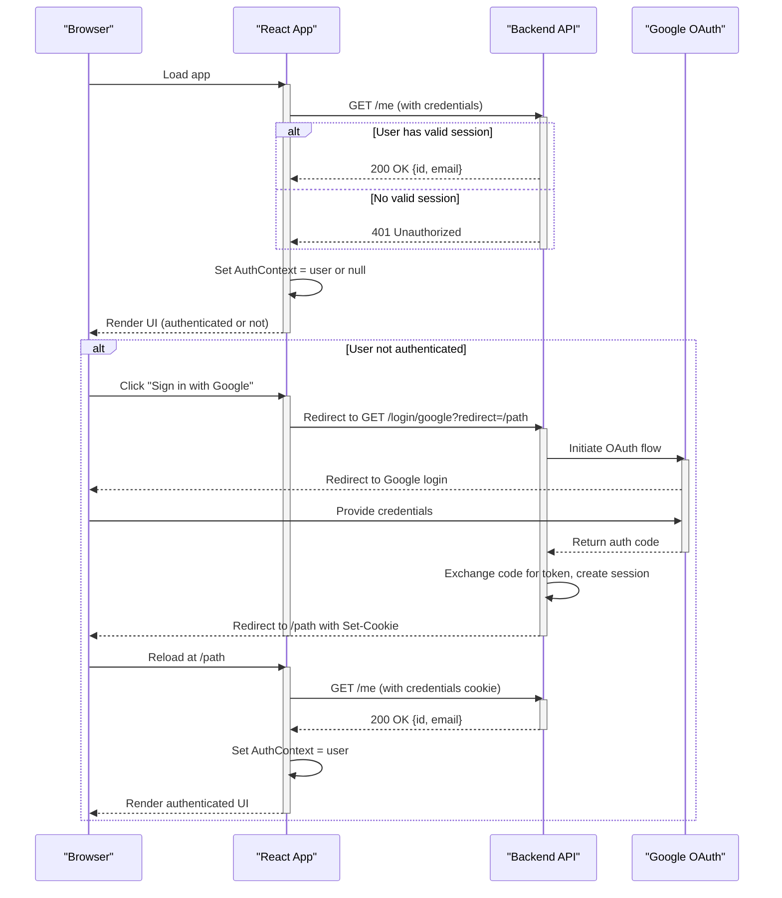
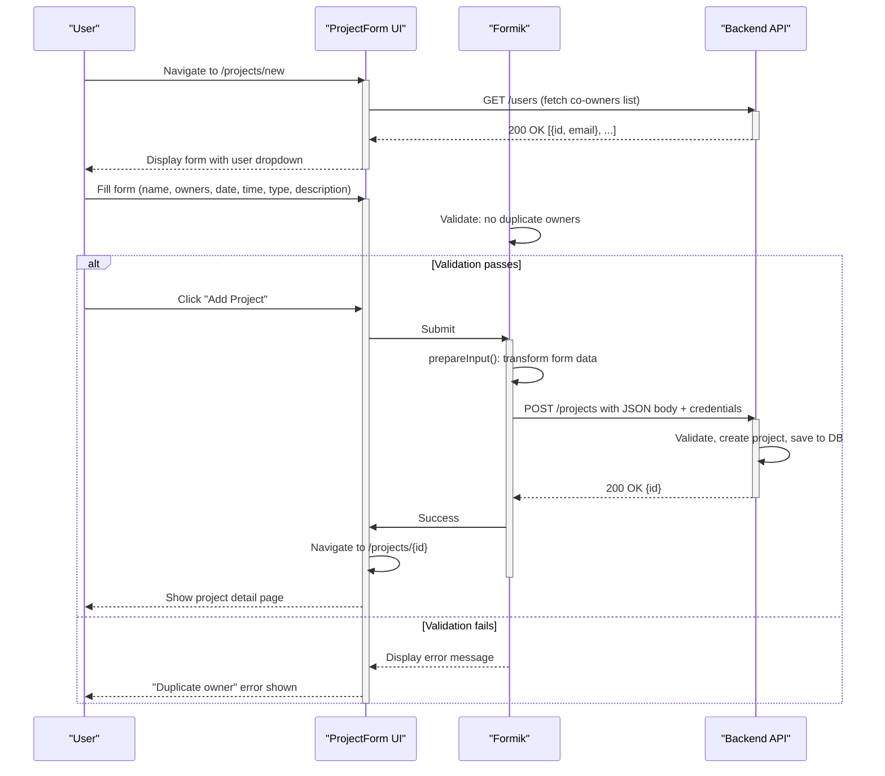
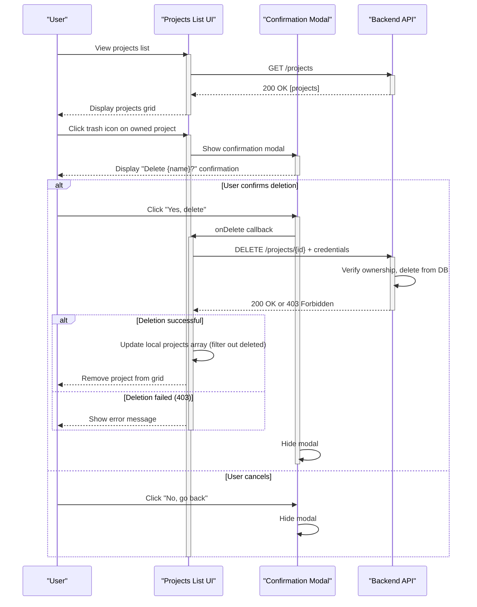

# Low-Level Design (LLD)
## hackBCA Example Frontend

**Repository:** AryanBhanushali/hackbca-example-frontend  
**Last Updated:** 2026-09-14  

---

## Module/Component Breakdown

### 1. App (Root Component)
**File:** `src/App.js`  
**Responsibility:**
- Initialize application and manage top-level state (authenticated user)
- Set up routing structure (React Router)
- Provide authentication context to all child components via `AuthContext`
- Fetch and populate current user on mount

**Public Interface:**
- Exports: `AuthContext` (React Context), `App` (default export)
- Props: None (root component)
- External dependencies: React Router, authentication API (`/me`)

---

### 2. Navigation (Navbar)
**File:** `src/Navbar.js`  
**Responsibility:**
- Display persistent navigation bar across all pages
- Show authenticated user email and sign-out link, or sign-in button if not authenticated
- Provide link to projects page
- Maintain session awareness via AuthContext

**Public Interface:**
- Exports: `Navbar` (functional component)
- Props: None
- Consumer of: `AuthContext`, `getAPIURL()`
- Side effects: Redirects to logout and login endpoints

---

### 3. Footer
**File:** `src/Footer.js`  
**Responsibility:**
- Display event footer with sponsor information, contact details, and copyright
- Provide navigation links to external resources

**Public Interface:**
- Exports: `Footer` (functional component)
- Props: None
- Dependencies: None (static content)

---

### 4. Pages - Home
**File:** `src/pages/Home.js`  
**Responsibility:**
- Display landing page with event information and hero graphic
- Provide navigation to projects page and login prompt
- Show event date/time placeholder (MM DD-DD 20XX @ BCA)

**Public Interface:**
- Exports: `Home` (functional component)
- Props: None
- Consumer of: `AuthContext`, `getAPIURL()`

---

### 5. Pages - Projects (List View)
**File:** `src/pages/Projects.js`  
**Responsibility:**
- Fetch and display all projects in a grid/table layout
- Allow authenticated users to create new projects
- Allow project owners to edit/delete their projects
- Handle loading and error states
- Display confirmation modal for deletion

**Public Interface:**
- Exports: `Projects` (functional component)
- Props: None
- Consumer of: `AuthContext`, `getAPIURL()`, formatting utilities, types
- Nested Component: `ProjectRow` (renders individual project row)
- Side effects: Fetch `GET /projects`, delete via `DELETE /projects/:id`

---

### 6. Pages - Project (Detail View)
**File:** `src/pages/Project.js`  
**Responsibility:**
- Fetch and display detailed information for a single project
- Display project metadata: name, owners, type, proposed date, time, description, URLs
- Show edit button only to project owners
- Handle 404 errors if project not found

**Public Interface:**
- Exports: `Project` (functional component)
- Props: None (uses `useParams()` for `:id`)
- Consumer of: `AuthContext`, `getAPIURL()`, formatting utilities, types
- Nested Component: `ProjectContent` (renders project details)
- Side effects: Fetch `GET /projects/:id`

---

### 7. Pages - ProjectForm
**File:** `src/pages/ProjectForm.js`  
**Responsibility:**
- Provide form for creating new projects or editing existing ones
- Validate form inputs and prevent duplicate owners
- Fetch list of available users for co-owner selection
- Transform form data into API-compatible format
- Submit data via POST (create) or PUT (update)
- Handle authentication checks and redirect if not logged in

**Public Interface:**
- Exports: `NewProjectForm`, `UpdateProjectForm` (functional components)
- Props: None (uses `useParams()` for `:id`, `useNavigate()` for routing)
- Consumer of: `AuthContext`, `getAPIURL()`, types
- Nested Components:
  - `ProjectFormContent` (form UI and logic)
  - `FormGroup` (text input wrapper)
  - `FormSelect` (dropdown wrapper)
  - `FormTextarea` (textarea wrapper)
  - `UserDropdown` (user selection dropdown)
- Side effects: Fetch `GET /users`, POST/PUT to `/projects`

---

### 8. Pages - Not Found (404)
**File:** `src/pages/404.js`  
**Responsibility:**
- Display 404 page for unknown routes

**Public Interface:**
- Exports: `NotFound` (functional component)
- Props: None

---

### 9. Utilities - getAPIURL
**File:** `src/utils.js`  
**Responsibility:**
- Return the base URL for all backend API calls
- Provide a single source of truth for API endpoint configuration

**Public Interface:**
- Exports: `getAPIURL()` (function, no parameters)
- Returns: `string` (API base URL)
- Logic: `process.env.REACT_APP_API_URL || "http://localhost:8000"`

---

### 10. Utilities - Formatting
**File:** `src/formatting.js`  
**Responsibility:**
- Provide date/time formatting utilities for consistent UI display

**Public Interface:**
- Exports:
  - `formatDateProposed(date: Date): string` — formats date as "Mon DD" (e.g., "Sep 14")
  - `formatTime(date: Date): string` — formats time as "H:MM AM/PM" (e.g., "2:30 PM")

---

### 11. Utilities - Types
**File:** `src/types.js`  
**Responsibility:**
- Define and export project type mappings (software, hardware)
- Provide helper functions for type label lookup

**Public Interface:**
- Exports:
  - `types` (object) — maps type keys to display labels
  - `getTypes()` — returns array of `{type, label}` objects
  - `getTypeLabel(type: string): string` — returns display label for a type

---

### 12. UI - Modals
**File:** `src/modals.js`  
**Responsibility:**
- Provide a styled modal wrapper using react-overlays
- Apply consistent styling (centered, white background, backdrop blur)

**Public Interface:**
- Exports: `StyledModal` (default export, functional component)
- Props: Passed through to `react-overlays` Modal (e.g., `show`, `onHide`, `children`)
- Side effects: Renders backdrop with blur effect

---

### 13. Styling
**File:** `src/index.css`  
**Responsibility:**
- Define global styles and custom CSS classes (e.g., `fancy-text`, `fancy-button`, Tailwind theme overrides)

**Files:** `tailwind.config.js`, `craco.config.js`  
**Responsibility:**
- Configure Tailwind CSS with custom theme colors (`hackbca-dark-blue`, `hackbca-orange`, etc.)
- Configure Craco to override Create React App defaults for Tailwind integration

---

## Key Classes / Functions

### App Component
```javascript
function App()
```
- **Purpose:** Root component; initializes user authentication and routing
- **Inputs:** None
- **Outputs:** JSX tree with Router, Navbar, Routes, Footer, AuthContext provider
- **Side Effects:**
  - Fetches `GET /me` on mount with credentials
  - Updates `user` state if response status is 200
  - Provides `AuthContext` value to all descendants

---

### ProjectRow Component
```javascript
function ProjectRow({project, onDelete})
```
- **Purpose:** Render a single project in the projects grid
- **Inputs:**
  - `project` (Project object): `{id, name, users, time, type}`
  - `onDelete` (function): Callback to handle deletion
- **Outputs:** JSX row with project details and action buttons (edit/delete if owner)
- **Important Side Effects:**
  - Conditionally shows edit/delete buttons only if authenticated user is an owner
  - Calls `onDelete(project)` on trash icon click

---

### Projects Component
```javascript
function Projects()
```
- **Purpose:** Fetch and display all projects
- **Inputs:** None
- **Outputs:** JSX with projects grid, add button, and delete confirmation modal
- **Side Effects:**
  - Fetches `GET /projects` on mount
  - Deletes project via `DELETE /projects/:id` with credentials
  - Updates local projects array after deletion
  - Displays error or loading state

---

### Project Component (Detail)
```javascript
function Project()
```
- **Purpose:** Fetch and display a single project's details
- **Inputs:** None (reads `:id` from URL params)
- **Outputs:** JSX with project content or error/loading state
- **Side Effects:**
  - Fetches `GET /projects/:id` on mount
  - Handles 404/422 errors gracefully
  - Shows edit button only if user is an owner

---

### ProjectFormContent Component
```javascript
function ProjectFormContent({update, project})
```
- **Purpose:** Render form for creating or updating a project
- **Inputs:**
  - `update` (string or undefined): Project ID if updating, undefined if creating
  - `project` (Project object or undefined): Existing project data for edit mode
- **Outputs:** JSX form with Formik state management
- **Important Side Effects:**
  - Fetches `GET /users` on mount to populate co-owner dropdown
  - On submit:
    - Transforms form data (date/time parsing, user ID concatenation)
    - Sends `POST /projects` (create) or `PUT /projects/:id` (update)
    - Navigates to project detail page on success
    - Displays error message on failure
  - Validates that no user is added twice as owner

---

### formatDateProposed Function
```javascript
export function formatDateProposed(date: Date): string
```
- **Purpose:** Format a Date object as "MMM DD" (e.g., "Sep 14")
- **Inputs:** Date object
- **Outputs:** Formatted string
- **Implementation:** Uses `toLocaleString("en-US", {day: "numeric", month: "short"})`

---

### formatTime Function
```javascript
export function formatTime(date: Date): string
```
- **Purpose:** Format a Date object as "H:MM AM/PM" (e.g., "2:30 PM")
- **Inputs:** Date object
- **Outputs:** Formatted string
- **Implementation:** Uses `toLocaleString("en-US", {hour: "numeric", minute: "2-digit"})`

---

### prepareInput Function
```javascript
function prepareInput({date_proposed, time, users, ...values}, currentUser)
```
- **Purpose:** Transform form data into API-compatible JSON structure
- **Inputs:**
  - Form values: `{date_proposed: "YYYY-MM-DD", time: "HH:MM", users: [id, ...], name, type, description, ...}`
  - `currentUser`: Currently authenticated user object with `id` field
- **Outputs:** Object with ISO-formatted dates/times and concatenated user IDs
- **Logic:**
  - Parses time string and constructs UTC Date
  - Parses date string and constructs UTC Date
  - Appends current user's ID to the users array (current user is always an owner)
  - Returns modified object with `time` and `date_proposed` as ISO strings

---

## Data Models / Schemas

### User
```javascript
{
  id: string | number,
  email: string
}
```

### Project
```javascript
{
  id: string | number,
  name: string,
  users: User[],
  time: string (ISO 8601),
  date_proposed: string (ISO 8601),
  type: "software" | "hardware",
  description: string,
  github?: string (optional URL),
  url?: string (optional URL)
}
```

### ProjectFormData (Formik Internal)
```javascript
{
  name: string,
  users: string[] (user IDs, excluding current user),
  date_proposed: string ("YYYY-MM-DD"),
  time: string ("HH:MM"),
  type: string ("software" | "hardware"),
  description: string
}
```

### AuthContext Value
```javascript
User | null
```

---

## Sequence Diagrams for Key Workflows

### Workflow 1: User Authentication and App Initialization



---

### Workflow 2: Creating a New Project



---

### Workflow 3: Deleting a Project



---

## Error Handling & Retry Behavior

### Network Errors
- **Catch Block:** Try-catch wraps all `fetch()` calls in async components
- **Behavior:** Error is stored in state and displayed to user as "Error: {error.message}"
- **Retry:** User must manually trigger action again (no automatic retry)
- **Example:** Projects list fails to load → display "Error: Network error"

### HTTP Error Status Codes
- **404 / 422 (Project Not Found):** Caught in try-catch; state set to null and error shown
- **401 (Unauthorized):** Backend session expired; user is not redirected automatically
- **403 (Forbidden):** User lacks permission (e.g., not a project owner); error displayed
- **500 (Server Error):** Generic error shown; no specific recovery logic

### Validation Errors
- **Formik Validation:** Custom validate functions run on form submit
- **Errors Displayed:** Per-field error messages shown in red below input (via `<ErrorMessage>`)
- **Example:** "What, do you have a quantum cloning machine?" (duplicate owner validation)

### Loading States
- **Indicator:** Spinning icon (FontAwesome `faCircleNotch` with `spin` prop)
- **Condition:** `const loading = !data && !error`
- **Displayed:** While async fetch is in flight; replaced with content or error on completion

### Graceful Degradation
- **No data persistence:** Page reload clears local state; user must re-fetch
- **No offline support:** No service worker or offline cache
- **Fallback pages:** 404 page shown for unknown routes via catch-all `<Route path="*">`

---

## Configuration & Environment-Specific Behavior

### Environment Variables
| Variable | Source | Usage | Example |
|----------|--------|-------|---------|
| `REACT_APP_API_URL` | Build-time (`.env` file or CI/CD) | Base URL for all API requests | `https://api.hackbca.com` or `http://localhost:8000` |

### Build-Time vs. Runtime
- **Build-Time Only:** `REACT_APP_API_URL` is embedded in the bundle during build
- **No Runtime Configuration:** Frontend cannot read environment variables at runtime
- **Implication:** Must rebuild to change API URL; cannot use same bundle across dev/staging/prod

### Development vs. Production
- **Development:** `npm start` uses CRA dev server with hot reload; API URL defaults to localhost:8000
- **Production:** `npm run build` outputs optimized bundle; `serve build` or HTTP server serves static files

### API Endpoint Configuration
- **Configurable Base URL:** All API calls use `getAPIURL()` which reads `REACT_APP_API_URL`
- **No Hardcoded Endpoints:** All backend URLs are constructed from base URL (e.g., `${getAPIURL()}/projects`)
- **Credentials:** All API calls use `credentials: "include"` to send HTTP-only cookies

### Feature Flags
- Not implemented in this frontend

### Logging & Analytics
- **Console Logging:** Error status codes logged to console if fetch fails (e.g., `console.error("Got status code: 200")`)
- **No Analytics:** No third-party analytics library integrated
- **No Distributed Tracing:** No trace IDs or correlation

---

## Known Limitations / Technical Debt

### 1. No Automatic Retry on Network Failure
- **Issue:** Network errors are caught and displayed, but no retry logic exists
- **Impact:** User must manually refresh or re-trigger action
- **Fix:** Implement exponential backoff retry with `fetch` wrapper

### 2. Duplicate Context Reads in Render
- **Issue:** Multiple components call `useContext(AuthContext)` redundantly (e.g., Projects.js lines 74, 89, 96)
- **Impact:** Slightly inefficient; minor performance cost
- **Fix:** Extract context value once at component top; pass as prop if needed

### 3. No Loading Skeleton or Placeholder
- **Issue:** Projects list shows "Loading projects..." with spinning icon, but page layout may shift
- **Impact:** Poor UX; cumulative layout shift
- **Fix:** Render skeleton cards or placeholder grid during load

### 4. Form Pre-Population Complexity
- **Issue:** ProjectForm.js line 103 has complex date/time formatting in initialValues
- **Impact:** Hard to maintain; prone to bugs with timezone handling
- **Fix:** Extract to utility function with tests

### 5. No Request Cancellation
- **Issue:** If user navigates away during a fetch, request completes in background and may set state on unmounted component
- **Impact:** React warning: "Warning: Can't perform a React state update on an unmounted component"
- **Fix:** Use `AbortController` to cancel requests on component unmount

### 6. Inline Styles and Magic Strings
- **Issue:** Tailwind classes used inline; no component abstraction for common patterns
- **Impact:** Difficult to maintain consistent styling; duplication
- **Fix:** Create reusable styled components (e.g., `<Button>`, `<Card>`)

### 7. No Input Sanitization
- **Issue:** User-supplied text (project names, descriptions) passed directly to state and rendered
- **Impact:** While React escapes by default, no explicit validation of input content
- **Fix:** Add input length limits and content validation on ProjectForm

### 8. Hardcoded Placeholder Text
- **Issue:** Event date "MM DD-DD 20XX @ BCA" is hardcoded in Home.js
- **Impact:** Must edit code to update event info
- **Fix:** Move to configuration or fetch from backend

### 9. Missing TypeScript or PropTypes
- **Issue:** No static type checking; JSDoc comments used but not enforced
- **Impact:** Type-related bugs may not be caught until runtime
- **Fix:** Migrate to TypeScript or add PropTypes validation

### 10. No CI/CD Pipeline Configuration
- **Issue:** No GitHub Actions, GitLab CI, or other pipeline defined in repository
- **Impact:** Manual testing and deployment required
- **Fix:** Add workflow to run tests and build on PR; auto-deploy on merge

### 11. useEffect with Async Directly
- **Issue:** ProjectForm and Project components use `useEffect(async () => {...})`
- **Impact:** Anti-pattern; can cause race conditions and memory leaks
- **Fix:** Wrap async call in separate function or use custom hook

---

## Change Log

### 2026-09-14 - Initial Documentation
- Generated LLD for hackBCA Example Frontend
- Documented all major components, modules, and key functions
- Included data models and API schemas
- Provided three detailed sequence diagrams for core workflows
- Identified 11 known limitations and technical debt items
- Noted configuration requirements and error handling patterns

